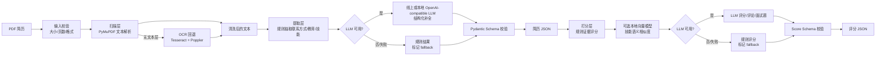

# Resume PDF Parser

## 项目简介

一个可通过命令行运行的 PDF 简历解析工具，支持提取 PDF 文本、识别结构化简历信息，以及根据岗位描述（JD）进行匹配评分。项目优先保证结果可校验、错误可恢复；没有 LLM 服务时也能使用本地规则完成演示。

## 技术选型

- Python 3.10+，通过 `argparse` 提供 CLI，通过 `setuptools` 打包为 `resume-cli`。
- PyMuPDF 负责 PDF 文本层解析；扫描件可选用 Tesseract、Poppler 和 `pytesseract` OCR。
- 正则、词表和 Pydantic 负责确定性字段抽取与严格 JSON 校验。
- LLM 使用 OpenAI-compatible Chat Completions 协议，兼容 OpenAI、DeepSeek、Ollama 和自定义响应路径。
- 可选 `sentence-transformers` 本地向量模型用于技能语义匹配；规则结果始终作为降级基线。

## 安装

克隆项目后，在仓库根目录执行安装向导：

```bash
./setup.sh
```

安装脚本会让你选择本地 Python 或 Docker，安装依赖，询问 LLM 配置，并将 `resume-cli` 链接到 `~/.local/bin`。安装完成后重新打开终端，或执行向导输出的 PATH 命令，即可直接使用 `resume-cli`。

如果安装过程中断或使用过旧版本脚本，先删除项目内的 `.venv` 后重新执行 `./setup.sh`；向导会先安装 `setuptools` 和 `wheel` 等构建工具，再安装项目本身。

本地 Python 模式要求 Python 3.10+；Docker 模式要求 Docker Desktop。安装向导会询问是否安装 OCR 依赖。配置位于 `config.toml` 的 `[ocr].enabled`；默认启用，扫描型 PDF 无文本层时自动回退到 OCR，也可用 `--no-ocr` 临时禁用。

LLM 配置位于 `config.toml`，模板为 `config.toml.example`。安装向导会询问是否启用 LLM、本地语义模型和 OCR；未选择本地模型时不会安装 `sentence-transformers`。配置启用本地模型后，程序会检查依赖和模型缓存，缺失时返回重新运行 `./setup.sh` 的引导，不会静默退回规则。可配置 OpenAI-compatible、Ollama、DeepSeek 或 `custom` provider；API Key 建议使用环境变量，不要提交到仓库。

## 环境变量

CLI 参数优先于环境变量，环境变量优先于 `config.toml`。常用变量如下：

| 变量 | 用途 |
| --- | --- |
| `RESUME_AI_ENABLED` | 是否启用 LLM |
| `RESUME_AI_PROVIDER` | `openai`、`deepseek`、`ollama` 或 `custom` |
| `RESUME_AI_BASE_URL` | OpenAI-compatible 服务地址 |
| `RESUME_AI_MODEL` | 模型名称 |
| `RESUME_AI_API_KEY` | API Key，推荐使用环境变量 |
| `RESUME_AI_FALLBACK_ENABLED` | LLM 失败时是否降级 |
| `RESUME_AI_TIMEOUT_SECONDS` | 请求超时时间 |
| `RESUME_AI_RESPONSE_PATH` | 自定义响应中的 JSON 路径，例如 `data.output.content` |
| `RESUME_AI_CONTENT_TYPE` | 响应内容类型：`text` 或 `json` |
| `RESUME_LOCAL_MODEL_ENABLED` | 是否启用本地语义模型 |
| `RESUME_LOCAL_EMBEDDING_MODEL` | 本地嵌入模型名称 |
| `RESUME_OCR_ENABLED` | 无文本层时是否启用 OCR |

示例：

```bash
export RESUME_AI_BASE_URL="https://api.example.com/v1"
export RESUME_AI_MODEL="your-model"
export RESUME_AI_API_KEY="your-api-key"
export RESUME_AI_ENABLED=true
```

## 使用方法

| 命令 | 用途 | 关键参数 |
| --- | --- | --- |
| `resume-cli parse <pdf>` | 提取 PDF 文本 | `--output`、`--no-ocr` |
| `resume-cli extract <pdf>` | 提取结构化简历 | `--mock`、`--config`、`--no-fallback` |
| `resume-cli score <pdf> --jd <jd>` | 计算 JD 匹配分数 | `--mock`、`--output`、`--no-fallback` |

所有命令都支持 `--help`、`--output`、`--config`、`--verbose`；`extract` 和 `score` 还支持模型地址、模型名称和 API Key 参数。

```bash
# 查看帮助
resume-cli --help
resume-cli parse --help

# 提取 PDF 文本
resume-cli parse ./resume.pdf
resume-cli parse ./resume.pdf --output parse.json

# 提取结构化简历信息
resume-cli extract ./resume.pdf --mock
resume-cli extract ./resume.pdf --output result.json

# 使用指定配置或临时关闭降级
resume-cli extract ./resume.pdf --config ./config.toml
resume-cli extract ./resume.pdf --no-fallback

# 根据 JD 评分
resume-cli score ./resume.pdf --jd ./jd.txt --mock
resume-cli score ./resume.pdf --jd ./jd.txt --output score.json
```

`--mock` 强制使用本地规则，不访问模型服务；`--output` 文件只保存本次 JSON 结果，进度和日志写入终端 stderr。模型失败并降级时，结果会增加 `_meta.fallback` 标记。

## 输入与输出示例

准备岗位描述 `jd.txt`：

```text
招聘 Python 后端工程师，要求熟悉 Python、Docker，3 年以上经验，本科及以上学历。
```

执行：

```bash
resume-cli extract ./resume.pdf --mock --output result.json
resume-cli score ./resume.pdf --jd ./jd.txt --mock --output score.json
```

`result.json` 示例：

```json
{
  "name": "张三",
  "phone": "13812345678",
  "email": "zhang@example.com",
  "city": "上海",
  "education": [{"school": "某某大学", "major": "计算机科学", "degree": "本科", "graduation_time": "2022"}],
  "skills": ["Python", "Docker"]
}
```

`score.json` 示例：

```json
{
  "overall_score": 82,
  "skill_score": 88,
  "experience_score": 80,
  "education_score": 100,
  "comment": "识别到 2/2 项岗位技能匹配。",
  "interview_questions": ["请介绍你在 Python 方面最有代表性的项目经验。"]
}
```

## 处理流程与分层结构



各层职责保持独立：扫描层只负责把 PDF 转成文本；提取层生成统一的简历字段；打分层结合简历 JSON、原文和 JD 计算分数。规则始终提供可解释基线，LLM 负责复杂归纳，本地 SentenceTransformer 当前主要用于打分层的技能语义补充。所有模型输出都必须通过 Schema 校验，失败时沿降级路径继续并在结果元数据中标记来源。

## 已实现功能

- `parse` 支持本地 PDF 文本提取，并处理文件不存在、格式错误、PDF 损坏和空文本。
- `extract` 输出姓名、电话、邮箱、城市、教育经历和技能；缺失标量为 `null`，列表为 `[]`。
- `score` 读取 JD，输出 0-100 的总分、技能/经验/学历分、理由和面试问题。
- 支持 `--help`、`--output`、`--mock`、结构化错误码和中文日志。
- LLM 返回支持有限 JSON 自动修复，并经过 Pydantic 严格 Schema 校验。
- 支持本地/线上 OpenAI-compatible 接口、超时、有限重试、降级和 `--no-fallback`。
- `provider = "custom"` 支持用 `response_path` 解析自定义嵌套响应。
- 提供 `Makefile`、`Dockerfile`、安装向导、配置模板、脱敏样例和基础测试。

## 已知问题与限制

- 规则抽取依赖内置技能词表，对新技能、复杂教育描述和无明确标签的字段识别有限。
- OCR 需要额外的 Python 包以及系统级 Tesseract、Poppler；不同系统的安装方式不同。
- 本地语义模型首次安装需要下载模型文件；运行时使用离线加载，不会自动联网下载。
- LLM 输出即使经过 JSON 修复仍可能被 Schema 拒绝；启用降级时会返回规则结果并标记 `_meta.fallback`。
- 当前评分是可解释的基础评分，尚未覆盖完整的项目经历、职级、行业和时间衰减等复杂因素。

## 后续扩展

当前规则优先识别联系方式、姓名和教育信息；启用本地模型后，`score` 会使用配置的 SentenceTransformer 嵌入模型补充技能语义匹配。Ollama 和其他 OpenAI-compatible 服务已经可以接入；后续可增加 PaddleNLP UIE、更丰富的技能词表、vLLM 专用适配和更完整的 OCR 后处理。所有扩展都应保留 Schema 校验、字段缺失处理、降级来源标记和脱敏评测。
