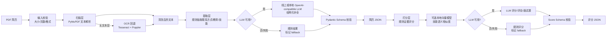

# Resume PDF Parser

一个可通过命令行运行的 PDF 简历解析工具，支持提取 PDF 文本、识别结构化简历信息，以及根据岗位描述（JD）进行匹配评分。项目优先保证结果可校验、错误可恢复；没有 LLM 服务时也能使用本地规则完成演示。

## 安装

克隆项目后，在仓库根目录执行安装向导：

```bash
./setup.sh
```

安装脚本会让你选择本地 Python 或 Docker，安装依赖，询问 LLM 配置，并将 `resume-cli` 链接到 `~/.local/bin`。安装完成后重新打开终端，或执行向导输出的 PATH 命令，即可直接使用 `resume-cli`。

本地 Python 模式要求 Python 3.10+；Docker 模式要求 Docker Desktop。安装向导会询问是否安装 OCR 依赖。配置位于 `config.toml` 的 `[ocr].enabled`；默认启用，扫描型 PDF 无文本层时自动回退到 OCR，也可用 `--no-ocr` 临时禁用。

LLM 配置位于 `config.toml`，模板为 `config.toml.example`。默认关闭 LLM、开启失败降级。安装向导会单独询问是否安装并启用本地语义模型；未选择时不会安装 `sentence-transformers`。配置启用本地模型后，程序会检查依赖和模型缓存，缺失时返回重新运行 `./setup.sh` 的引导，不会静默退回规则。可配置 OpenAI-compatible、Ollama、DeepSeek 或 `custom` provider；API Key 建议使用 `RESUME_AI_API_KEY` 环境变量，不要提交到仓库。

## 使用方法

```bash
# 查看帮助
resume-cli --help
resume-cli parse --help

# 提取 PDF 文本
resume-cli parse ./resume.pdf
resume-cli parse ./resume.pdf --output parse.json

# 提取结构化简历信息
resume-cli extract ./resume.pdf --mock
resume-cli extract ./resume.pdf --output result.json

# 使用指定配置或临时关闭降级
resume-cli extract ./resume.pdf --config ./config.toml
resume-cli extract ./resume.pdf --no-fallback

# 根据 JD 评分
resume-cli score ./resume.pdf --jd ./jd.txt --mock
resume-cli score ./resume.pdf --jd ./jd.txt --output score.json
```

`--mock` 强制使用本地规则，不访问模型服务；`--output` 文件只保存本次 JSON 结果，进度和日志写入终端 stderr。模型失败并降级时，结果会增加 `_meta.fallback` 标记。

## 处理流程与分层结构



各层职责保持独立：扫描层只负责把 PDF 转成文本；提取层生成统一的简历字段；打分层结合简历 JSON、原文和 JD 计算分数。规则始终提供可解释基线，LLM 负责复杂归纳，本地 SentenceTransformer 当前主要用于打分层的技能语义补充。所有模型输出都必须通过 Schema 校验，失败时沿降级路径继续并在结果元数据中标记来源。

## 已实现功能

- `parse` 支持本地 PDF 文本提取，并处理文件不存在、格式错误、PDF 损坏和空文本。
- `extract` 输出姓名、电话、邮箱、城市、教育经历和技能；缺失标量为 `null`，列表为 `[]`。
- `score` 读取 JD，输出 0-100 的总分、技能/经验/学历分、理由和面试问题。
- 支持 `--help`、`--output`、`--mock`、结构化错误码和中文日志。
- LLM 返回支持有限 JSON 自动修复，并经过 Pydantic 严格 Schema 校验。
- 支持本地/线上 OpenAI-compatible 接口、超时、有限重试、降级和 `--no-fallback`。
- `provider = "custom"` 支持用 `response_path` 解析自定义嵌套响应。
- 提供 `Makefile`、`Dockerfile`、安装向导、配置模板、脱敏样例和基础测试。

## 扩展能力

当前规则优先识别联系方式、姓名和教育信息；启用本地模型后，`score` 会使用配置的 SentenceTransformer 嵌入模型补充技能语义匹配。BGE/M3E/E5 的具体模型可在安装向导中选择；PaddleNLP UIE、本地 Ollama/vLLM 和更完整的 OCR 仍可继续扩展。所有扩展都应保留 Schema 校验、字段缺失处理、降级来源标记和脱敏评测。
